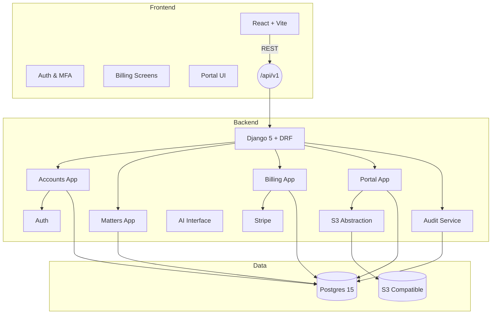

# Architecture

## Module Boundaries

- **core** – settings, middleware, security hardening, tenant context
- **accounts** – organizations, users, roles, invitations, MFA stubs, auth endpoints
- **matters** – clients, contacts, matters with soft-delete flags and reference codes
  auto-numbered per organization
- **billing** – time entries, expenses, invoices, payments, reporting helpers
- **portal** – documents, messaging threads, share links with S3 streaming
- **services** – shared infrastructure (storage, notifications, audit, AI abstractions)
- **services.storage** – S3-compatible storage helpers (MinIO via `https://storage.legal.getbukd.com`) with optional `S3_EXTERNAL_ENDPOINT_URL` for public presigned URLs
- **integrations** – Stripe and DocuSign/Dropbox Sign adapters (stubbed)
- **notifications** – in-app notification store + delivery helpers for email/SaaS events
- **client_portal** – read-only REST surface for client users (documents, invoices, dashboard)
- **frontend** – React Router app with Tailwind UI, typed fetch client, SWR caching, paginated + searchable tables

## Request Flow

1. Browser sends request with httpOnly JWT + CSRF token to `/api/v1`.
2. Middleware extracts organization from token claims, populates tenant context.
3. Viewsets inherit `OrganizationModelViewSet` to enforce row-level tenancy.
4. Actions trigger audit events and optional S3 interactions.
5. Responses pass through DRF with pagination, filtering, throttling.

## Extension Points

- Swap Postgres FTS with OpenSearch by implementing search service
- Plug real Stripe Connect + DocuSign flows into `integrations/`
- Replace AI mock provider with managed inference service (Bedrock, Azure OpenAI)
- Expand `case_rules` and `research` packages into full products
- Integrate real virus scanning and quarantine workflow by plumbing `services.storage.virus_scan`
- Push notifications/SMS by replacing the notification service stub with a provider adapter
