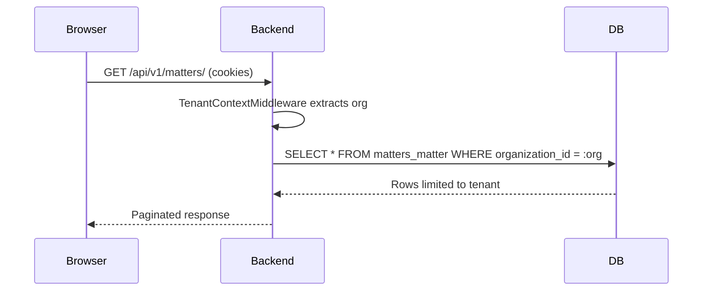

# Tenancy Model

## Overview

- Each record carries an `organization_id`
- JWT tokens embed `org_id` claim set during login
- `TenantContextMiddleware` places `request.organization_id` and updates audit context
- `OrganizationScopedQuerySetMixin` filters all queries and enforces `serializer.save(organization=...)`

## Enforcement Layers

1. **Authentication** – `JWTCookieAuthentication` extracts org claim, validates CSRF for unsafe calls.
2. **Viewsets** – All domain viewsets inherit `OrganizationModelViewSet`, eliminating accidental cross-org reads/writes.
3. **Serializers** – Sensitive relations (attachments, share links) validate organization consistency.
4. **Storage** – S3 keys prefixed with `{org_id}/...`, enabling bucket policies per tenant.
5. **Audit** – `AuditEvent` persists org + actor for traceability.

## Multi-Tenant DB Pattern

- Postgres schema shared across tenants
- Indexes on `(organization_id, created_at)` for partition-friendly queries
- Future: row-level security policies can be layered on top if desired

## Requests Lifecycle

## Storage Isolation

- S3 bucket uses IAM policies to restrict to `org_id` prefix
- Share links include opaque tokens tied to document + organization

## Future Enhancements

- Add org-aware caching keys (Redis)
- Partition large tables by `organization_id`
- Integrate billing by organization for metered SaaS pricing
- Harden client portal queries (currently limited via `ClientPortalMixin`) for future offline access
